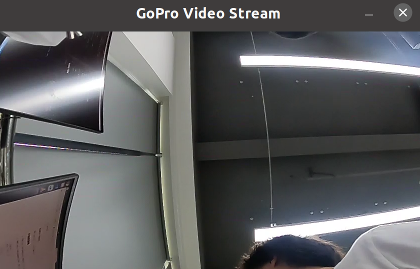

## GoPro-Tools

参考 OpenGoPro C++ Demo 重新改写

## 开始前准备
1、检查 GoPro 型号和固件版本，确保能进行二次开发（支持的设备表格在上面链接里面）

2、使用 GoPro 专用的线连接到计算机，使用 `WireShark` 进行抓包来确定 GoPro 的 IP地址（一种取巧的方法）

```bash
# 构建项目
bash ./build.sh

cd build
# 开启相机推流
./stream -s

# 捕获网络视频流并显示(等待片刻会可视化显示出来)
./video_stream_reader

# 关闭相机推流
./stream -e
```

## 网络推流可视化结果

